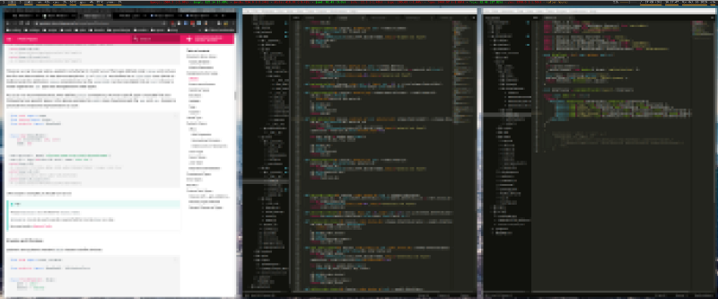

# Command Line Stonks

This project was originally housed as part of my arch linux system dotfiles. However, it quickly evolved.

The `cli_stonks` module is a fully-functional, command-line wrapper around various parts of the TD Ameritrade API. It currently features quote and account information retrieval, rudimentary risk analysis (e.g. sharpe ratio/risk-free rate scraping), and various other utlity functions--such as storing daily portfolio volatility in a BigQuery table provided you have a Google Cloud account.

I am not a financial advisor.

Medium Article: https://nealdotpy.medium.com/i-cheated-on-windows-and-it-was-the-best-decision-of-my-life-b380a2f9d9c9

Previous Repository: https://github.com/nealdotpy/dotfiles/tree/master/bin/scripts/stockbar

# Documentation

This module assumes a decent level of familiarity with the TD Ameritrade API.

Browsing `main.py` should help in understanding how this executable script works under the hood. I've refactored it in such a way that reading it becomes trivial.

In order to get our own module up and running, you'll need to create an `.env` file and browse the `cli_stonks.constants` module in order to see the constants needed for functionality to work.

Of course, you may need to adjust the terminal color codes for your own system and emulator. I use rxvt-unicode, so mine are set accordingly.

In addition, if you use a broker other than TD Ameritrade, you'll likely find no use in this module. I would like to automate the the 90-day refresh token intervals. Currently, those are handled manually when the system notifies me of repeated failures to get a new `access_token`. This is primarily due to the layers of Auth I have behind my own account such as 2FA.

`cloud/` contains the code for the cloud function I set up in Google Cloud Platform. In turn, this function is linked to a BigQuery Table. Much of the cloud functionality is in its infancy at the moment. I intend to put the risk-free rate scraping into its own table as well and automate it via a cloud function.

The `config` file is only relevant if using the `watchlist` functionality to hook into Polybar (see: `main.py`).

I've done my best to make the code as readable as I can, including using `typing` and comments where functionality might be unclear. 


# Smudge/Clean Git Filters
In order to use the same repository across different systems, the python shebang needs to be handled. Using smudging and cleaning, it becomes possible to port shebangs on a per-system basis (on checkout) and clean them when pushing changes (checkin).

The following script takes the place of `sed` one-liners since BSD/GNU `sed` operate differently within git; adapted from [here](https://github.com/gaozhidf/git_smudge_clean_example).

**Note:** `#!/path/to/python` is the designated replacement expression in `origin:main/main.py`. 

### `smudge_clean_filter.py`
```
import sys
from functools import reduce

REPLACE_CONTENT = [
    ('#!/path/to/python', '#!/path/to/your/project/virtual/environment/bin/python')
]

def usage():
    print(
        """usage:
        1. for git smudge 
            python keyfilter.py --smudge
        2. for git clean
            python keyfilter.py --clean
        """
    )

def smudge():
    for line in sys.stdin:
        '''
        replace keyword list in line
        https://stackoverflow.com/questions/2484156/is-str-replace-replace-ad-nauseam-a-standard-idiom-in-python
        '''
        line = reduce(lambda s, r: s.replace(*r), REPLACE_CONTENT, line)
        sys.stdout.write(line)

def clean():
    for line in sys.stdin:
        line = reduce(lambda s, r: s.replace(*r[::-1]), REPLACE_CONTENT, line)
        sys.stdout.write(line)

if __name__ == '__main__':
    try:
        if sys.argv[1] == '--smudge':
            smudge()
        elif sys.argv[1] == '--clean':
            clean()
        else:
            usage()
    except Exception as e:
        print(f'exeception occured:\n{e}')
        usage()
```


Once a part of the local project (and ignored), the `.git/config` file should contain pointers to this script for handling smudging and cleaning:
```
[filter "pyshebang"]
	smudge = python smudge_clean_filter.py --smudge
	clean = python smudge_clean_filter.py --clean
```

The `.gitattributes` file already contains the addition of this filter. 

**Note:** should you choose not to set this up, the filter will merely fail silently.


# Previews





